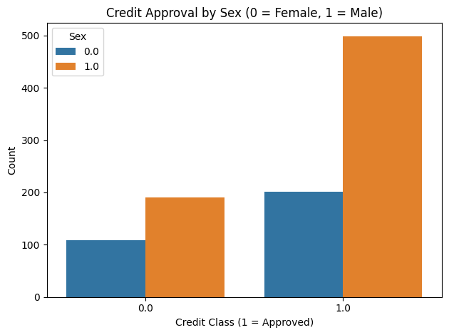
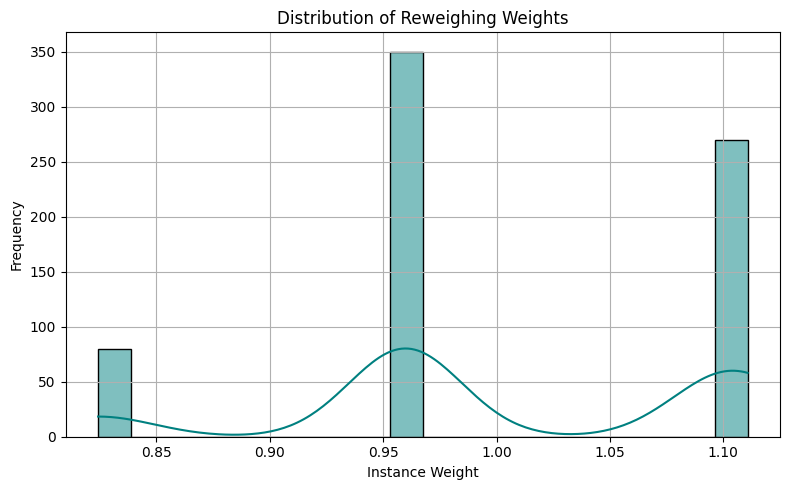
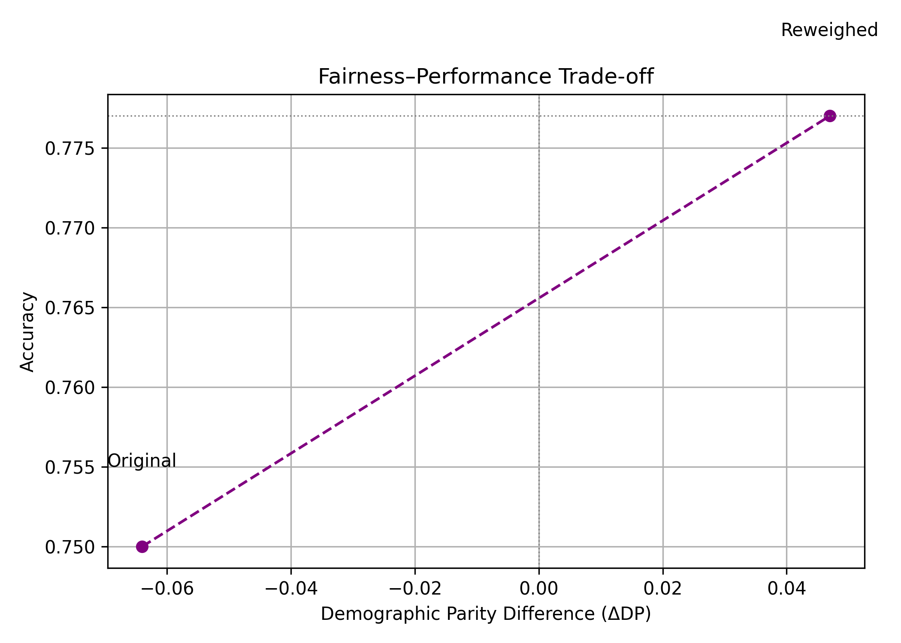

# 💳 Fair Loan Approval Using Reweighing and Logistic Regression

This project addresses **representational bias** in credit scoring using the **German Credit dataset**. It applies **logistic regression** and mitigates bias using the **Reweighing pre-processing technique** from IBM's [AIF360](https://github.com/Trusted-AI/AIF360) toolkit.

---

## 📌 Objectives

- Identify gender-based bias in loan approval models.
- Quantify bias using fairness metrics such as:
  - Demographic Parity Difference
  - Disparate Impact
- Apply the Reweighing algorithm to mitigate bias.
- Compare performance before and after fairness intervention.

---

## 📂 Project Structure

```
.
├── data/                         # Dataset directory
├── figures/                      # Images used in LaTeX report
├── images/                       # Project visualizations (used below)
│   ├── credit_approval_by_sex.png
│   ├── reweighing_weight_distribution.png
│   └── fairness_performance_tradeoff.png
├── notebooks/
│   └── main.ipynb  # Main Jupyter notebook
├── requirements.txt              # Required Python packages
├── README.md                     # Project documentation
└── report/
    ├── main.tex                  # LaTeX thesis/report
    └── ...                       # Abstract, intro, results, etc.
```

---

## 🖼️ Visual Insights

### 1. Credit Approval by Sex

Shows disparity in loan approval rates between male and female applicants before reweighing.



### 2. Distribution of Reweighing Weights

Illustrates how the reweighing algorithm adjusts instance importance across groups.



### 3. Fairness–Performance Trade-off

Demonstrates how reweighing improves fairness while slightly increasing accuracy.



---

## 🚀 Getting Started

1. **Clone the project**  
   ```bash
   git clone https://github.com/your-username/fair-loan-approval.git
   cd fair-loan-approval
   ```

2. **Create a virtual environment**
   ```bash
   python -m venv venv
   source venv/bin/activate  # or venv\Scripts\activate on Windows
   ```

3. **Install dependencies**
   ```bash
   pip install -r requirements.txt
   ```

4. **Download the German Credit dataset**  
   Place these files in:
   ```
   <env>/Lib/site-packages/aif360/data/raw/german/
   ```
   - [german.data](https://archive.ics.uci.edu/ml/machine-learning-databases/statlog/german/german.data)
   - [german.doc](https://archive.ics.uci.edu/ml/machine-learning-databases/statlog/german/german.doc)

---

## 🧠 Key Fairness Metrics

| Metric                     | Original Model | Reweighed Model |
|---------------------------|----------------|-----------------|
| Accuracy                  | 0.750          | 0.777           |
| Demographic Parity Diff.  | -0.064         | 0.047           |
| Disparate Impact          | 0.918          | 1.066           |

---

## 🛠 Technologies

- Python 3.11+
- scikit-learn
- AIF360
- pandas, seaborn, matplotlib
- LaTeX (for the written report)

---

## ✍️ Author

**Julius Laggah**  
School of Software, Nankai University  
Email: laggahjulius@gmail.com

---

## 📄 License

This project is for academic use only.
